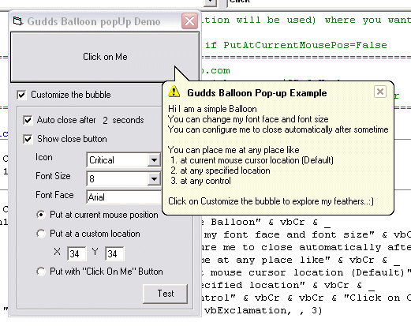



## Gudds Balloon popUp

### Description

Ever though of a Balloon popUp like u see in the Win XP.. Here it goes .."Gudds Balloon popUp"

You can configure it the way you want, ie you can set to close it automatically, set the icon or having no icon at all, show/hide close button, font face, font size. You can position at three places..at current mouse cursor position, at some defined co-ordinate (X,Y position) or at the location of a particular control..Check it!

I am trying to introduce the fade out effect.

Please give ur feedback
 
### More Info
 
Use it anywhere you want...

             |
---                |---
**Submitted On**   |2003-03-28 16:43:10
**By**             |[Kundan](https://github.com/Planet-Source-Code/PSCIndex/blob/master/ByAuthor/kundan.md)
**Level**          |Intermediate
**User Rating**    |4.8 (57 globes from 12 users)
**Compatibility**  |VB 5\.0, VB 6\.0
**Category**       |[Custom Controls/ Forms/  Menus](https://github.com/Planet-Source-Code/PSCIndex/blob/master/ByCategory/custom-controls-forms-menus__1-4.md)
**World**          |[Visual Basic](https://github.com/Planet-Source-Code/PSCIndex/blob/master/ByWorld/visual-basic.md)
**Archive File**   |[Gudds\_Ball1565603282003\.zip](https://github.com/Planet-Source-Code/kundan-gudds-balloon-popup__1-44318/archive/master.zip)

